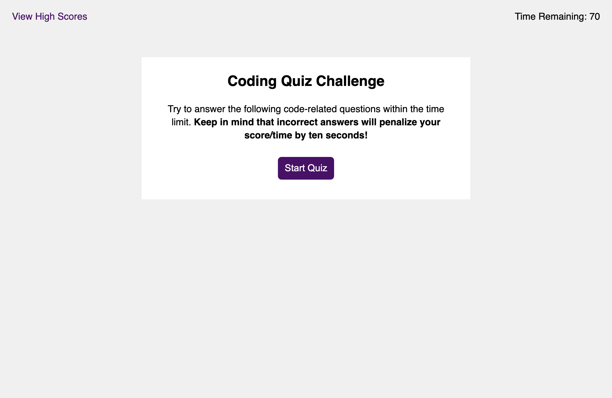
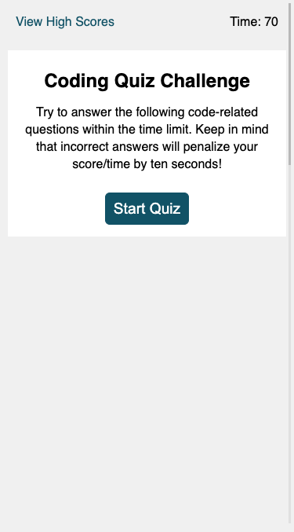

# interactive-code-quiz
Description: This single page application provides a fun learning experience for the user. User must select from multiple option questions and has 70 seconds to complete the quiz. Answering a question incorrectly will cause the user to lose 10 additional seconds from the clock. If time runs out, the user will receive their score at that point. High scores are kept in local storate and displayed. The user may enter initials into a form to be posted on the high score list. This application uses JavaScript.

Link to deployed application:
https://lindseyjeejan.github.io/interactive-code-quiz/

Desktop:

Mobile:

Copyright (c)2021 Lindsey Lauria

Permission is hereby granted, free of charge, to any person obtaining a copy of this software and associated documentation files (the "Software"), to deal in the Software without restriction, including without limitation the rights to use, copy, modify, merge, publish, distribute, sublicense, and/or sell copies of the Software, and to permit persons to whom the Software is furnished to do so, subject to the following conditions:

The above copyright notice and this permission notice shall be included in all copies or substantial portions of the Software.

THE SOFTWARE IS PROVIDED "AS IS", WITHOUT WARRANTY OF ANY KIND, EXPRESS OR IMPLIED, INCLUDING BUT NOT LIMITED TO THE WARRANTIES OF MERCHANTABILITY, FITNESS FOR A PARTICULAR PURPOSE AND NONINFRINGEMENT. IN NO EVENT SHALL THE AUTHORS OR COPYRIGHT HOLDERS BE LIABLE FOR ANY CLAIM, DAMAGES OR OTHER LIABILITY, WHETHER IN AN ACTION OF CONTRACT, TORT OR OTHERWISE, ARISING FROM, OUT OF OR IN CONNECTION WITH THE SOFTWARE OR THE USE OR OTHER DEALINGS IN THE SOFTWARE.
