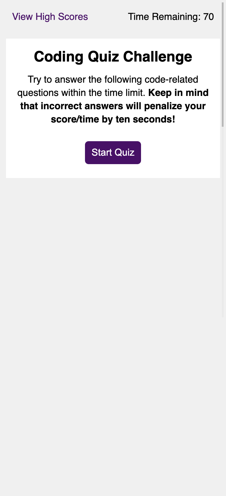

# interactive-code-quiz
Single page application consisting of a timed quiz for the user. User must select from multiple option questions and has 70 seconds to complete the quiz. If time runs out, the user will receive their score at that point. High scores are kept and displayed, user must enter initials into a form to be posted on the high score list.

Link to deployed application:
https://lindseyjeejan.github.io/interactive-code-quiz/

Desktop:

Mobile:

